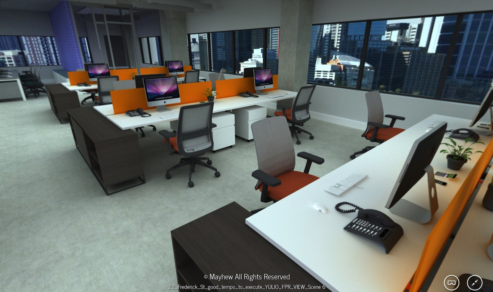

## Yulio Ray Tracer

Yulio Ray Tracer is a simple photo-realistic renderer that is based on the Embree Example Renderer (part of the Intel [Embree SDK](https://embree.github.io/)). The main goal behind its development was to provide an easy and automated way of generating stereoscopic cubic maps for arbitrary 3D scenes. To achieve that goal, it uses Collada as the main asset import format and implements a simple omni-directional dome-based lighting model, so that any scene can be lit without the need to specify light sources. Overall, it extends the Embree renderer by adding the following features and capabilities:

- Stereoscopic cubic map rendering
- Support for the Collada file format
- Asynchronous DLL API with adjustable thread priority
- A simple universal dome lighting model
- An Uber shader with the alpha channel support
- Bi-linear texture filtering
- Watermark image integration
- Lots of other small things :)

### Supported Platforms & Compilation

Currently only Windows x64 is supported (due to some of the 3rd party binaries provided in x64 format only). Windows 8.x and 10 have been tested, although earlier versions should work too.

VS 2015 projects are provided. The CMake files are out of date, so they won't work. We do plan to update them at some point in the future (or if someone's willing to do it for us, we'd be even happier :))

By default, the project is meant to be complied as a DLL (use Release_DLL or Debug_DLL configurations). It can also be compiled as a stand-alone executable (use Release or Debug configurations).

### Sample Scene

A sample scene has been included, with the Collada export and textures, so you can test the renderer. The scene is provided by [Mayhew](http://www.mayhew.ca), and they retain all copyright on the image and textures.

### Running the renderer
Since the renderer was converted to a DLL, we
have included a small test project called *rt_test_dll*, that can be used to initiate the rendering of an arbitrary scene in .dae format as well as change some of the parameters (the comments in the code should make them self-explanatory).

### 3rd Party Dependencies
The following 3rd party software and libraries are used by the project:

- [FreeGLUT](http://freeglut.sourceforge.net/)
- [GLM](http://glm.g-truc.net/)
- [Embree](https://embree.github.io/)
- [Assimp](http://www.assimp.org/) (modified to our needs)
- [LodePNG](http://lodev.org/lodepng/)
- [FreeImage](http://freeimage.sourceforge.net/)
- [libjpeg-turbo](http://libjpeg-turbo.virtualgl.org/)

### Author

* [Lev Faynshteyn](https://github.com/lfaynshteyn)
